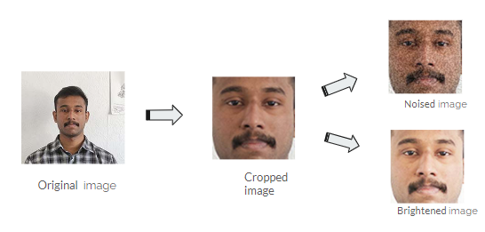
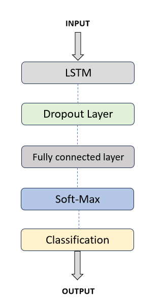
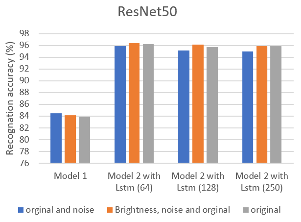

# Decoding Emotions: How Temporal Modelling Enhances Recognition Accuracy

Master Thesis - Biomedical Engineering  

## Summary

This project explores **Facial Emotion Recognition (FER)** using **pre-trained CNNs** (ResNet50, GoogleNet, AlexNet) combined with **LSTM layers** to model temporal patterns. The system achieved **96.4% accuracy** on the **Oulu-CASIA dataset** and is optimized for potential **real-time applications**.

## Methods

The model pipeline includes:

- **Preprocessing**:
  - Face detection using Haar Cascade and LBP.
  - Image resizing based on CNN input needs.
  - Data augmentation with Salt & Pepper noise and brightness enhancement.
    

  
- **Model Architecture**:
  - **Model 1**: CNNs — ResNet50, GoogleNet, AlexNet.
  - **Model 2**: CNN feature extraction + LSTM layers with 64–250 units.
  -  

- **Training**:
  - Optimizers: Adam (Model 1), SGDM (Model 2).
  - Dataset split: 70% training, 30% validation.
  - Epochs: 40, Batch size: 50, Learning rate: 0.0001.

## Results

### Model 1 (CNN only)

| Model    | Max Accuracy |
|----------|--------------|
| ResNet50 | 84.48%       |
| GoogleNet| 87.50%       |
| AlexNet  | 86.13%       |

### Model 2 (CNN + LSTM)

| Model + LSTM | Max Accuracy |
|--------------|--------------|
| ResNet50 + LSTM | **96.40%** |
| GoogleNet + LSTM| 94.21%     |
| AlexNet + LSTM  | 94.06%     |

Adding LSTM layers consistently improved performance across all models. **ResNet50 + LSTM** yielded the best accuracy.
  

## Tags

`Facial-Emotion-Recognition` `Deep-Learning` `LSTM` `CNN` `Autism-Spectrum-Disorder` `Image-Classification` `Temporal-Modeling` `Machine-Learning` `Biomedical-Engineering` `Master-Thesis`

---
